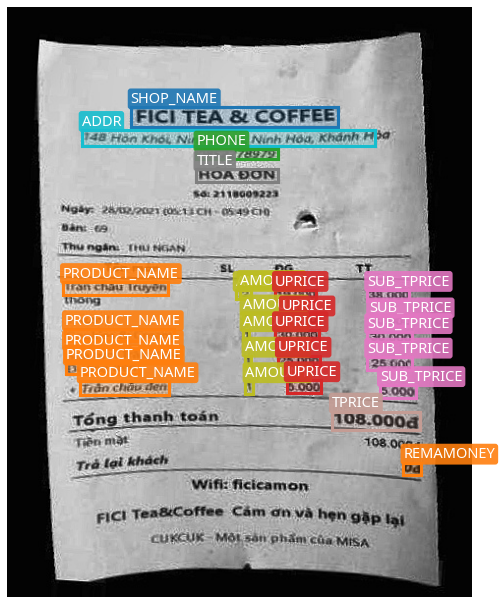
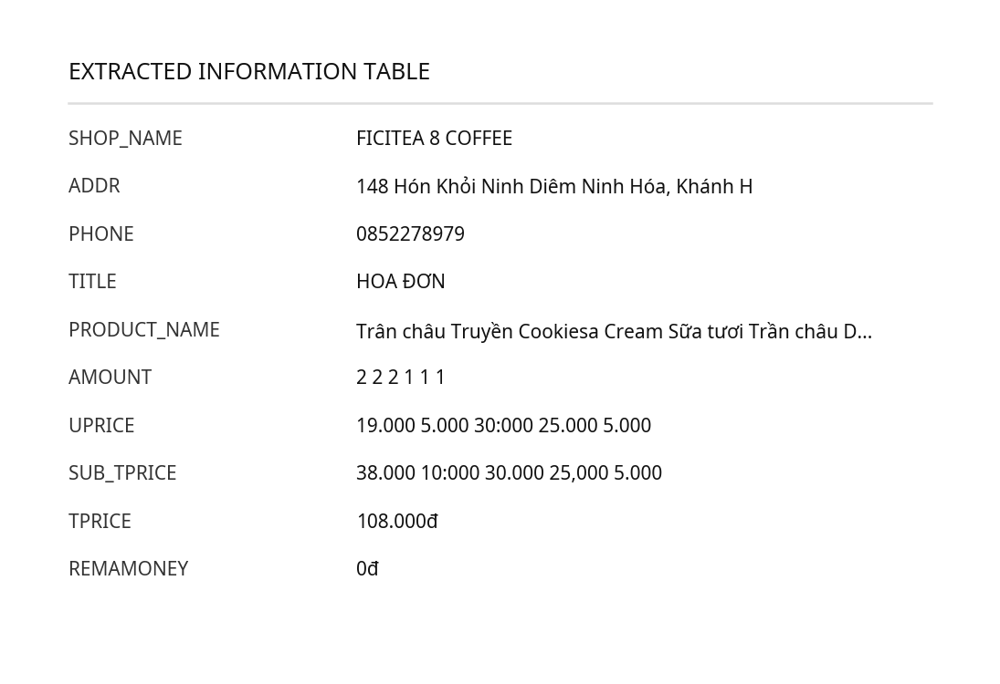
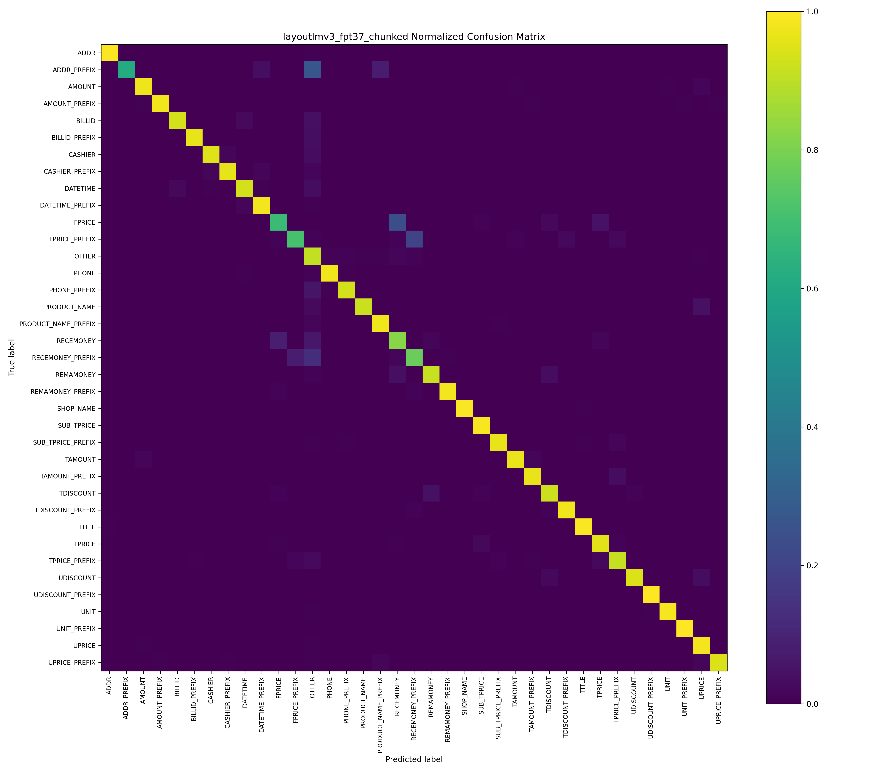

# An End-to-End Method to Extract Key Information for Vietnamese Retail Receipts

This pipeline represents my final bachelor thesis project, which provides an end-to-end Computer Vision and Deep Learning solution designed to automatically segment, normalize, detect, transcribe, and extract key structured information from photos of Vietnamese retail receipts.

## Pipeline Architecture


## Methodology & Stages

### Stage 1: Receipt Segmentation & Detection (01_Segmentation_And_Detection_YOLO)
Automatically localizes and segments the receipt from noisy backgrounds using a YOLOv8 Segmentation model.

*   **Result**: The segmentation model achieved an outstanding **Box mAP50 of 99.5%**, **Box Precision of 99.7%**, and **Box Recall of 100%**; and a **Mask mAP50 of 99.5%**, **Mask Precision of 99.7%**, and **Mask Recall of 100%** on the validation set.


### Stage 2: Receipt Image Normalization (02_Normalize_Receipts)
A multi-step preprocessing suite to clean up the segmented document.

**2.1 Background Removal & Cropping (01_background_removal_and_cropping):**
Masks out the background pixels to black and crops the image strictly to the receipt's bounding box.


**2.2 Rotation Correction (02_rotation_correction):**
Classifies the orientation of the cropped receipt and rotates it upright.
*   **Result**: The ResNet-18 model achieved an outstanding validation accuracy of **99.15%** (Macro F1-score of **97.38%**) and a test accuracy of **99.10%** (Macro F1-score of **96.67%**).


**2.3 Deskewing & Enhancing (03_deskewing_and_enhancing):**
Evaluates text alignment angles and performs deskewing to align text lines horizontally.


### Stage 3: Text Bounding Box Detection (03_text_detection)
Identifies and locates individual text lines and blocks across the normalized, upright receipt.
*   **Result**: The YOLOv8 Nano text detection model achieved a **Box mAP50 of 97.2%**, **Box Precision of 94.8%**, and **Box Recall of 97.2%** on the validation set.


### Stage 4: Text Recognition (OCR) (04_text_recognition)
Converts cropped text line boxes into digital text, optimized for Vietnamese character diacritics.
*   **Result**: The fine-tuned VietOCR model achieved a **full sequence accuracy of 0.74** and a **per-character accuracy of 0.89**.


### Stage 5: Key Information Extraction (05_kie_layoutlmv3)
Extracts semantic entities from the recognized text using LayoutLMv3, combining textual features, visual features, and spatial 2D coordinates.
*   **Result**: The fine-tuned LayoutLMv3 model achieved a **Macro Average F1-Score of 0.93 (0.925)** and an overall **Accuracy of 93.78%** on the test set across **37 entity classes**.

**KIE Visual Prediction:**



**Structured Extraction Table:**



**Confusion Matrix:**



**Per-Entity Classification Report (37 entities):**

| Entity | Precision | Recall | F1-Score | Support |
| :--- | :---: | :---: | :---: | :---: |
| ADDR | 0.9822 | 0.9940 | 0.9881 | 167 |
| ADDR_PREFIX | 0.8000 | 0.6154 | 0.6957 | 26 |
| AMOUNT | 0.9881 | 0.9765 | 0.9823 | 511 |
| AMOUNT_PREFIX | 0.9942 | 0.9773 | 0.9857 | 176 |
| BILLID | 0.9689 | 0.9341 | 0.9512 | 167 |
| BILLID_PREFIX | 0.9625 | 0.9625 | 0.9625 | 160 |
| CASHIER | 0.9396 | 0.9524 | 0.9459 | 147 |
| CASHIER_PREFIX | 0.9739 | 0.9613 | 0.9675 | 155 |
| DATETIME | 0.9415 | 0.9365 | 0.9390 | 189 |
| DATETIME_PREFIX | 0.9627 | 0.9810 | 0.9718 | 158 |
| FPRICE | 0.7816 | 0.6800 | 0.7273 | 100 |
| FPRICE_PREFIX | 0.7857 | 0.7097 | 0.7458 | 93 |
| OTHER | 0.9390 | 0.9078 | 0.9231 | 1779 |
| PHONE | 0.9231 | 0.9783 | 0.9499 | 184 |
| PHONE_PREFIX | 0.8933 | 0.9371 | 0.9147 | 143 |
| PRODUCT_NAME | 0.9841 | 0.9201 | 0.9510 | 538 |
| PRODUCT_NAME_PREFIX | 0.9130 | 0.9800 | 0.9453 | 150 |
| RECEMONEY | 0.6989 | 0.8228 | 0.7558 | 158 |
| RECEMONEY_PREFIX | 0.7613 | 0.7712 | 0.7662 | 153 |
| REMAMONEY | 0.9076 | 0.9153 | 0.9114 | 118 |
| REMAMONEY_PREFIX | 0.9412 | 0.9825 | 0.9614 | 114 |
| SHOP_NAME | 0.9854 | 0.9951 | 0.9902 | 204 |
| SUB_TPRICE | 0.9784 | 0.9920 | 0.9852 | 502 |
| SUB_TPRICE_PREFIX | 0.9829 | 0.9663 | 0.9745 | 178 |
| TAMOUNT | 0.9221 | 0.9726 | 0.9467 | 73 |
| TAMOUNT_PREFIX | 0.9091 | 0.9677 | 0.9375 | 62 |
| TDISCOUNT | 0.8776 | 0.9247 | 0.9005 | 93 |
| TDISCOUNT_PREFIX | 0.9286 | 0.9785 | 0.9529 | 93 |
| TITLE | 0.9824 | 0.9940 | 0.9882 | 168 |
| TPRICE | 0.9286 | 0.9548 | 0.9415 | 177 |
| TPRICE_PREFIX | 0.9278 | 0.9126 | 0.9201 | 183 |
| UDISCOUNT | 0.9674 | 0.9468 | 0.9570 | 94 |
| UDISCOUNT_PREFIX | 0.8286 | 1.0000 | 0.9062 | 29 |
| UNIT | 0.9803 | 0.9868 | 0.9835 | 151 |
| UNIT_PREFIX | 0.9778 | 1.0000 | 0.9888 | 44 |
| UPRICE | 0.9075 | 0.9812 | 0.9429 | 480 |
| UPRICE_PREFIX | 0.9765 | 0.9486 | 0.9623 | 175 |
| **Accuracy** | | | **0.9378** | **8092** |
| **Macro Avg** | **0.9217** | **0.9302** | **0.9249** | **8092** |
| **Weighted Avg** | **0.9388** | **0.9378** | **0.9378** | **8092** |

## Datasets Used in the Projects

All datasets used across the five stages of this project are publicly available via Google Drive:

📁 **[Access Datasets on Google Drive](https://drive.google.com/drive/folders/1CaN_-4wBZdzH7aB07bxvuvRyz7Dsom-L?usp=sharing)**

The datasets cover the following stages:

| Stage | Description |
| :--- | :--- |
| Stage 1 — Segmentation & Detection | Annotated receipt images with segmentation masks for YOLOv8 training |
| Stage 2 — Normalization | Labeled images for rotation classification (ResNet-18) and deskewing |
| Stage 3 — Text Detection | Receipt images with bounding box annotations for text line detection |
| Stage 4 — Text Recognition (OCR) | Cropped text line images paired with ground-truth transcriptions |
| Stage 5 — Key Information Extraction | Token-level annotated receipts with 37 entity classes for LayoutLMv3 |

## Repository Directory Layout

```bash
.
├── 01_Segmentation_And_Detection_YOLO/
├── 02_Normalize_Receipts/
│   ├── 01_background_removal_and_cropping/
│   ├── 02_rotation_correction/
│   └── 03_deskewing_and_enhancing/
├── 03_text_detection/
├── 04_text_recognition/
├── 05_kie_layoutlmv3/
├── models/
├── datasets/
├── utils/
├── README.md
└── full_pipeline.drawio.png
```

## Extracted Information Sample Output

The final result of the extraction pipeline generates a highly structured dictionary/JSON mapped as follows:

| Field Label | Extracted Text |
| :--- | :--- |
| SHOP_NAME | FICITEA & COFFEE |
| ADDR | 148 Hòn Khói Ninh Diêm Ninh Hòa, Khánh H |
| PHONE | 0852278979 |
| TITLE | HOÁ ĐƠN |
| PRODUCT_NAME | Trân châu Truyền Cookiesa Cream Sữa tươi Trân châu D... |
| AMOUNT | 2 2 2 1 1 1 |
| UPRICE | 19.000 5.000 30.000 25.000 5.000 |
| TPRICE | 108.000đ |
