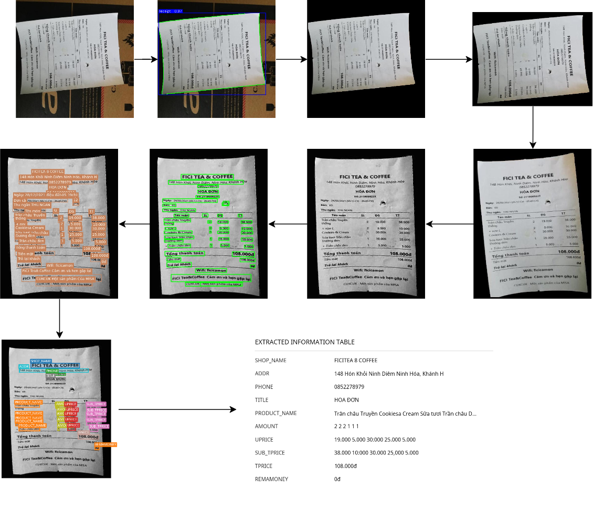
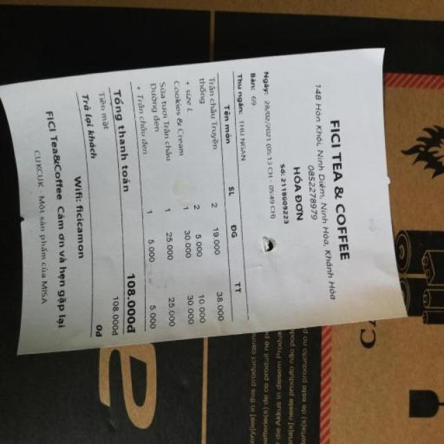
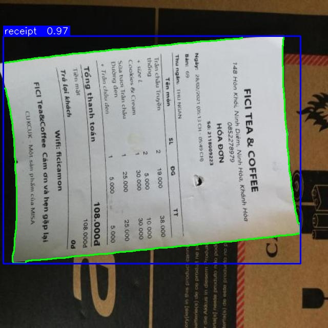
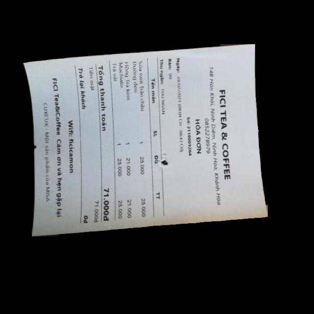
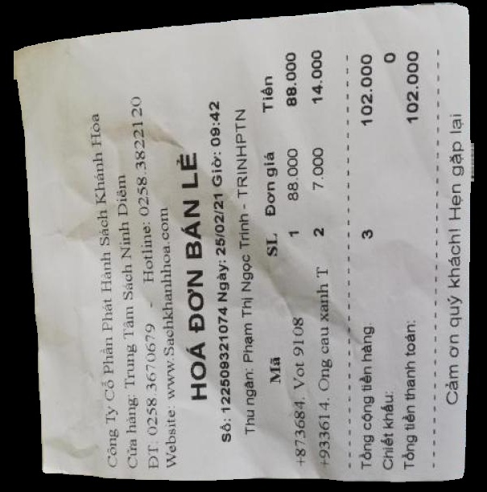
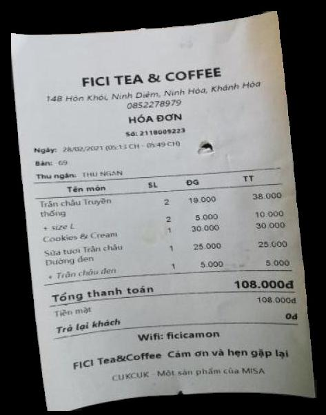
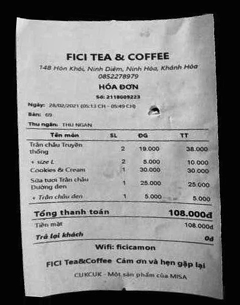
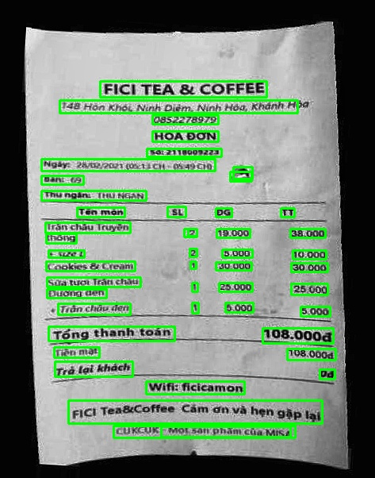
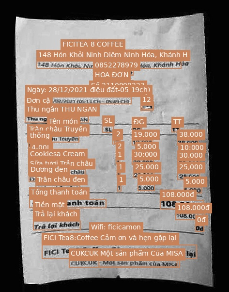

# An End-to-End Method to Extract Key Information for Vietnamese Retail Receipts

An end-to-end Computer Vision and Deep Learning pipeline to automatically segment, normalize, detect, transcribe, and extract key structured information from photos of Vietnamese retail receipts.

## Pipeline Architecture



## Methodology & Stages

### Stage 1: Receipt Segmentation & Detection (01_Segmentation_And_Detection_YOLO)
Automatically localizes and segments the receipt from noisy backgrounds using a YOLOv8 Segmentation model.

*   **Result**: The segmentation model achieved an outstanding **Box mAP50 of 99.5%**, **Box Precision of 99.7%**, and **Box Recall of 100%**; and a **Mask mAP50 of 99.5%**, **Mask Precision of 99.7%**, and **Mask Recall of 100%** on the validation set.





### Stage 2: Receipt Image Normalization (02_Normalize_Receipts)
A multi-step preprocessing suite to clean up the segmented document.

**2.1 Background Removal & Cropping (01_background_removal_and_cropping):**
Masks out the background pixels to black and crops the image strictly to the receipt's bounding box.

**Segmented Mask & Cropped Result:**



**2.2 Rotation Correction (02_rotation_correction):**
Classifies the orientation of the cropped receipt and rotates it upright.
*   **Result**: The ResNet-18 model achieved an outstanding validation accuracy of **99.15%** (Macro F1-score of **97.38%**) and a test accuracy of **99.10%** (Macro F1-score of **96.67%**).



**2.3 Deskewing & Enhancing (03_deskewing_and_enhancing):**
Evaluates text alignment angles and performs deskewing to align text lines horizontally.



### Stage 3: Text Bounding Box Detection (03_text_detection)
Identifies and locates individual text lines and blocks across the normalized, upright receipt.
*   **Result**: The YOLOv8 Nano text detection model achieved a **Box mAP50 of 97.2%**, **Box Precision of 94.8%**, and **Box Recall of 97.2%** on the validation set.



### Stage 4: Text Recognition (OCR) (04_text_recognition)
Converts cropped text line boxes into digital text, optimized for Vietnamese character diacritics.
*   **Result**: The fine-tuned VietOCR model achieved a **full sequence accuracy of 0.74** and a **per-character accuracy of 0.89**.



### Stage 5: Key Information Extraction (05_kie_layoutlmv3)
Extracts semantic entities from the recognized text using LayoutLMv3, combining textual features, visual features, and spatial 2D coordinates.
*   **Result**: The fine-tuned LayoutLMv3 model achieved a **Macro Average F1-Score of 0.93 (0.925)**.


Target Entities (37 total):
- SHOP_NAME
- ADDR
- ADDR_PREFIX
- AMOUNT
- AMOUNT_PREFIX
- BILLID
- BILLID_PREFIX
- CASHIER
- CASHIER_PREFIX
- DATETIME
- DATETIME_PREFIX
- FPRICE
- FPRICE_PREFIX
- OTHER
- PHONE
- PHONE_PREFIX
- PRODUCT_NAME
- PRODUCT_NAME_PREFIX
- RECEMONEY
- RECEMONEY_PREFIX
- REMAMONEY
- REMAMONEY_PREFIX
- SUB_TPRICE
- SUB_TPRICE_PREFIX
- TAMOUNT
- TAMOUNT_PREFIX
- TDISCOUNT
- TDISCOUNT_PREFIX
- TITLE
- TPRICE
- TPRICE_PREFIX
- UDISCOUNT
- UDISCOUNT_PREFIX
- UNIT
- UNIT_PREFIX
- UPRICE
- UPRICE_PREFIX

## Repository Directory Layout

```bash
.
├── 01_Segmentation_And_Detection_YOLO/
├── 02_Normalize_Receipts/
│   ├── 01_background_removal_and_cropping/
│   ├── 02_rotation_correction/
│   └── 03_deskewing_and_enhancing/
├── 03_text_detection/
├── 04_text_recognition/
├── 05_kie_layoutlmv3/
├── models/
├── datasets/
├── utils/
├── README.md
└── full_pipeline.drawio.png
```

## Extracted Information Sample Output

The final result of the extraction pipeline generates a highly structured dictionary/JSON mapped as follows:

| Field Label | Extracted Text |
| :--- | :--- |
| SHOP_NAME | FICITEA & COFFEE |
| ADDR | 148 Hòn Khói Ninh Diêm Ninh Hòa, Khánh H |
| PHONE | 0852278979 |
| TITLE | HOÁ ĐƠN |
| PRODUCT_NAME | Trân châu Truyền Cookiesa Cream Sữa tươi Trân châu D... |
| AMOUNT | 2 2 2 1 1 1 |
| UPRICE | 19.000 5.000 30.000 25.000 5.000 |
| TPRICE | 108.000đ |
